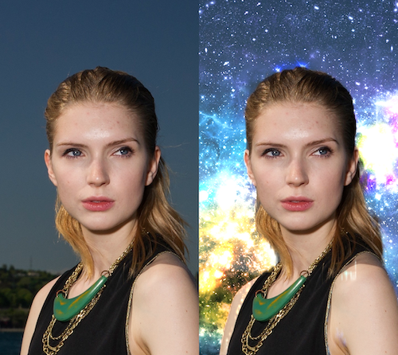
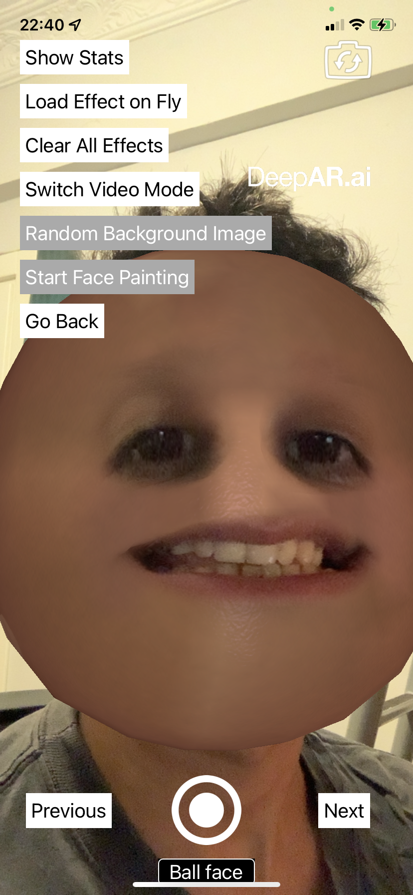

# react-native-deepar <!-- omit in toc -->

[](https://npmjs.com/package/react-native-deepar)
[](https://circleci.com/gh/ridvanaltun/react-native-deepar/tree/master)
[](http://commitizen.github.io/cz-cli/)
[](https://github.com/ridvanaltun/react-native-deepar/blob/master/LICENSE)

> Snapchat-like filters, AR lenses, and real-time facial animations.

> React-Native wrapper for [DeepAR](https://www.deepar.ai/).

## Table of Contents <!-- omit in toc -->

- [What is DeepAR?](#what-is-deepar)
- [Compatibility](#compatibility)
- [Getting Started](#getting-started)
  - [Other Required Steps](#other-required-steps)
    - [Android](#android)
      - [Proguard](#proguard)
    - [iOS](#ios)
  - [Requesting Permissions](#requesting-permissions)
    - [Getting Permissions](#getting-permissions)
    - [Requesting Permissions](#requesting-permissions-1)
- [Installing AR Models](#installing-ar-models)
- [Using AR Models over Internet](#using-ar-models-over-internet)
- [Usage](#usage)
- [API](#api)
  - [Props](#props)
  - [Events](#events)
  - [Methods](#methods)
    - [General](#general)
    - [Camera Control](#camera-control)
    - [Video Recording](#video-recording)
    - [Change Parameters](#change-parameters)
    - [Core](#core)
  - [Camera Module](#camera-module)
- [Background Segmentation](#background-segmentation)
- [Face Painting](#face-painting)
- [Watermark](#watermark)
- [Example App](#example-app)
- [Limitations](#limitations)
- [Contributing](#contributing)
- [License](#license)

## What is DeepAR?

| Preview                                                                 |
| ----------------------------------------------------------------------- |
|  |
| This GIF taken from DeepAR offical site.                                |

DeepAR is an infrastructure where you can make AR applications in ease. DeepAR is not free, but you can create applications that can be used by up to 10 people for testing purposes for free.

- Check pricing from [Pricing Page](https://developer.deepar.ai/pricing).
- In order to use DeepAR, you need to generate an API key. You can generate the API key from the [Developer Panel](https://developer.deepar.ai/).
- With the [Asset Store](https://www.store.deepar.ai/), you can buy ready to use AR content.
- If you're looking for free filters, here is some: [Free Filter Pack](https://docs.deepar.ai/deep-ar-studio/free-filter-pack)
- With the [DeepAR Studio](https://www.deepar.ai/creator-studio), you can create, edit and fine tune your own AR content.
- To learn DeepAR Studio, visit [DeepAR Help Center](https://help.deepar.ai/en/).

**DeepAR Features:**

- [Face Filters, Effects and Masks](https://www.deepar.ai/face-filters-lenses-masks)
- [AR Beauty & Makeup](https://www.deepar.ai/beauty-and-makeup)
- [Realtime Hair Color Segmentation](https://www.deepar.ai/hair-coloring)
- [Background Removal and Segmentation](https://www.deepar.ai/background-removal)
- [Realtime Emotion Detection](https://www.deepar.ai/emotion-detection)

You can visit [DeepAR's offical site](https://www.deepar.ai/) to learn more.

## Compatibility

| DeepAR SDK | lib version (`react-native-deepar`) | Required React Native Version | Android SDK (Min) | iOS Version (Min) |
| ---------- | ----------------------------------- | ----------------------------- | ----------------- | ----------------- |
| 3.4.2      | `>= 0.1.0` && `<= 0.10.2`           | `>= 0.64.2`                   | 21                | 11.0              |
| 3.4.4      | `>= 0.10.3` && `<= 0.10.5`          | `>= 0.64.2`                   | 23                | 11.0              |
| 5.2.0      | `>= 0.11.0`                         | `>= 0.64.2`                   | 23                | 11.0              |

## Getting Started

:warning: This library under development, if you found a bug, please open an issue from [here](https://github.com/ridvanaltun/react-native-deepar/issues/new).

:warning: It only works on physical devices, not will work with simulator.

```sh
yarn add react-native-deepar
```

### Other Required Steps

#### Android

1. Open your project's `AndroidManifest.xml` and add the following lines:

```xml
<uses-permission android:name="android.permission.CAMERA" />

<!-- optionally, if you want to record audio: -->
<uses-permission android:name="android.permission.RECORD_AUDIO" />
```

2. Update your `minSdkVersion` version minimum `23`, `compileSdkVersion` and `targetSdkVersion` version minimum `31` from `android/build.gradle` file, like below:

```diff
buildscript {
    ext {
        buildToolsVersion = "29.0.3"
-        minSdkVersion = 20
-        compileSdkVersion = 30
-        targetSdkVersion = 30
+        minSdkVersion = 23
+        compileSdkVersion = 31
+        targetSdkVersion = 31
    }
}
```

##### Proguard

If you're using Proguard, make sure to add rules below:

```
-keepclassmembers class ai.deepar.ar.DeepAR { *; }
-keepclassmembers class ai.deepar.ar.core.videotexture.VideoTextureAndroidJava { *; }
-keep class ai.deepar.ar.core.videotexture.VideoTextureAndroidJava
```

#### iOS

1. Open your project's `Info.plist` and add the following lines:

```xml
<key>NSCameraUsageDescription</key>
<string>$(PRODUCT_NAME) needs access to your Camera.</string>

<!-- optionally, if you want to record audio: -->
<key>NSMicrophoneUsageDescription</key>
<string>$(PRODUCT_NAME) needs access to your Microphone.</string>
```

2. Open your `ios/YourProject.xcworkspace` file in Xcode and update your iOS version to `11.0` minimum, like below:

| Setting iOS Version from Xcode                                                                  |
| ----------------------------------------------------------------------------------------------- |
|  |
| Follow steps in the picture.                                                                    |

3. Add `DeepAR.xcframework` to Build Phases:

| Add DeepAR to Build Phases (1)                                                                              | Add DeepAR to Build Phases (2)                                                                              |
| ----------------------------------------------------------------------------------------------------------- | ----------------------------------------------------------------------------------------------------------- |
|  |  |
| Follow steps in the picture.                                                                                | Follow steps in the picture.                                                                                |

**Note:** Don't forget install Pods for iOS and rebuild your app.

### Requesting Permissions

You need to ask necessary permissions before render the DeepAR component.

#### Getting Permissions

Simply use the get functions to find out if a user has granted or denied permission before:

```jsx
import { Camera } from 'react-native-deepar';

// ..

const cameraPermission = await Camera.getCameraPermissionStatus();
const microphonePermission = await Camera.getMicrophonePermissionStatus();
```

A permission status can have the following values:

- `authorized`: Your app is authorized to use said permission. Continue with using the `<DeepAR>` view.
- `not-determined`: Your app has not yet requested permission from the user. Continue by calling the request functions.
- `denied`: Your app has already requested permissions from the user, but was explicitly denied. You cannot use the request functions again, but you can use the [Linking API](https://reactnative.dev/docs/linking#opensettings) to redirect the user to the Settings App where he can manually grant the permission.
- `restricted`: (iOS only) Your app cannot use the Camera or Microphone because that functionality has been restricted, possibly due to active restrictions such as parental controls being in place.

#### Requesting Permissions

Use the request functions to prompt the user to give your app permission to use the Camera or Microphone.

```jsx
import { Camera } from 'react-native-deepar';

// ..

const cameraPermission = await Camera.requestCameraPermission();
const microphonePermission = await Camera.requestMicrophonePermission();
```

- `authorized`: Your app is authorized to use said permission. Continue with using the `<DeepAR>` view.
- `denied`: The user explicitly denied the permission request alert. You cannot use the request functions again, but you can use the [Linking API](https://reactnative.dev/docs/linking#opensettings) to redirect the user to the Settings App where he can manually grant the permission.

## Installing AR Models

1. Put your AR models into a desired destination
2. Create `react-native.config.js` like below:

```js
module.exports = {
  assets: ['./assets/effects'], // <-- example destination
};
```

3. Add a NPM script like below:

```diff
{
  "scripts": {
+   "asset": "./node_modules/.bin/react-native-copy-asset"
  }
}
```

4. Run the script to link your AR models

```sh
npm run asset
```

**Note:** If you remove an AR model, you can run the same command for unlinking removed asset.

## Using AR Models over Internet

You don't have to install AR models in your app, you can use AR models over Internet.

1. Install [rn-fetch-blob](https://github.com/joltup/rn-fetch-blob) to your project
2. You can use AR models over internet like below:

```tsx
import RNFetchBlob from 'rn-fetch-blob';

RNFetchBlob.config({
  fileCache: true,
})
  .fetch('GET', 'http://betacoins.magix.net/public/deepar-filters/8bitHearts')
  .then((res) => {
    deepARRef?.current?.switchEffectWithPath({
      path: res.path(),
      slot: 'effect',
    });
  });
```

## Usage

Make registration to DeepAR and get an API key from [Developer Panel](https://developer.deepar.ai/).

```tsx
import React, { useRef } from 'react';
import DeepAR, { IDeepARHandle } from 'react-native-deepar';

const App = () => {
  const deepARRef = useRef<IDeepARHandle>(null);

  return (
    <DeepAR
      ref={deepARRef}
      apiKey="your-api-key"
      style={{ flex: 1 }}
      onInitialized={() => {
        // ..
      }}
    />
  );
};
```

## API

The `<DeepAR>` component can take a number of inputs to customize it as needed. They are outlined below:

### Props

| Prop        | Type            | Default               | Required     | Description                                                                                                                                                                                                                                                                                                                                                 |
| ----------- | --------------- | --------------------- | ------------ | ----------------------------------------------------------------------------------------------------------------------------------------------------------------------------------------------------------------------------------------------------------------------------------------------------------------------------------------------------------- |
| apiKey      | string          | undefined             | <b>true</b>  | Make registration to DeepAR and get an API key from [Developer Panel](https://developer.deepar.ai/).                                                                                                                                                                                                                                                        |
| position    | CameraPositions | CameraPositions.FRONT | <b>false</b> | Camera position, back and front. You can change in real-time.                                                                                                                                                                                                                                                                                               |
| videoWarmup | boolean         | false                 | <b>false</b> | If set to true, changes how `startRecording` and `resumeRecording` methods work; `startRecording` method will no longer start the video recording immediately, instead it triggers `onVideoRecordingPrepared` event. You can start video recording with `resumeRecording` after `onVideoRecordingPrepared` event triggered. **Note:** Only available in iOS |

### Events

These are various events that you can hook into and fire functions on in the component:

| Callback                 | Callback Params                                       | Description                                                                                                                     |
| ------------------------ | ----------------------------------------------------- | ------------------------------------------------------------------------------------------------------------------------------- |
| onInitialized            | <div align="center">-</div>                           | Called when the DeepAR is initialized. DeepAR methods should not be called before the initialization is completed.              |
| onEffectSwitched         | (<b>slot</b>: string)                                 | Called when an effect has been switched.                                                                                        |
| onScreenshotTaken        | (<b>path</b>: string)                                 | Called when the screen capture is finished.                                                                                     |
| onVideoRecordingPrepared | <div align="center">-</div>                           | Called when the video recording is prepared. Check `videoWarmup` option to learn more. **Note:** Only available in iOS          |
| onVideoRecordingStarted  | <div align="center">-</div>                           | The start of the video recording process is not synchronous, so this method will be called when the video recording is started. |
| onVideoRecordingFinished | (<b>path</b>: string)                                 | Called when the video recording is finished.                                                                                    |
| onCameraSwitched         | (<b>facing</b>: CameraPositions)                      | Called when camera switched.                                                                                                    |
| onFaceVisibilityChanged  | (<b>visible</b>: boolean)                             | Called when the user's face becomes visible or invisible.                                                                       |
| onImageVisibilityChanged | (<b>visible</b>: boolean, <b>gameObject</b>?: string) | Called when a natural image is being tracked and the visibility has changed.                                                    |
| onError                  | (<b>text</b>: string, <b>type</b>: ErrorTypes,)       | Called when an error occur, like the model path not found or the effect file failed to load.                                    |

### Methods

These are the various methods.

#### General

| Method               | Params                                 | Description                                                                                                                                                                                                                                                                  |
| -------------------- | -------------------------------------- | ---------------------------------------------------------------------------------------------------------------------------------------------------------------------------------------------------------------------------------------------------------------------------- |
| switchEffect         | (<b>params</b>: ISwitchEffect)         | The method used to switch any effect in the scene. Effects are places in slots. Every slot is identified by its unique name and can hold one effect at any given moment. Every subsequent call to this method removes the effect that was previously displayed in this slot. |
| switchEffectWithPath | (<b>params</b>: ISwitchEffectWithPath) | Same as `switchEffect` but with path.                                                                                                                                                                                                                                        |
| fireTrigger          | (<b>trigger</b>: string)               | This method allows the user to fire a custom animation trigger for model animations from code. To fire a custom trigger, the trigger string must match the custom trigger set in the Studio when creating the effect.                                                        |
| takeScreenshot       | <div align="center">-</div>            | Captures a screenshot of the current screen. When a screenshot is done `onScreenshotTaken` will be called with a resulting screenshot.                                                                                                                                       |
| setTouchMode         | (<b>enabled</b>: boolean)              | This method enable or disable the detection of touches over DeepAR view, it is necessary if your effect has ability to detect touches.                                                                                                                                       |

#### Camera Control

| Method     | Params                    | Description   |
| ---------- | ------------------------- | ------------- |
| setFlashOn | (<b>enabled</b>: boolean) | Toggle flash. |

#### Video Recording

| Method          | Params                                                                    | Description                                                                                                                                                                 |
| --------------- | ------------------------------------------------------------------------- | --------------------------------------------------------------------------------------------------------------------------------------------------------------------------- |
| startRecording  | (<b>params</b>?: [IStartRecording](./docs/interfaces.md#istartrecording)) | Starts video recording of the camera preview.                                                                                                                               |
| pauseRecording  | <div align="center">-</div>                                               | Pauses video recording.                                                                                                                                                     |
| resumeRecording | <div align="center">-</div>                                               | Resumes video recording after it has been paused with `pauseRecording`.                                                                                                     |
| finishRecording | <div align="center">-</div>                                               | Stops video recording and starts the process of saving the recorded video to the file system. When the file is saved, the method `onVideoRecordingFinished` will be called. |
| setAudioMute    | (<b>enabled</b>: boolean)                                                 | Mutes/unmutes the audio while video recording.                                                                                                                              |

#### Change Parameters

For more details about changeParameter API read this article [here](https://help.deepar.ai/en/articles/3732006-changing-filter-parameters-from-code).

| Method                 | Params                                   | Description                                                                                                                                                                                                                            |
| ---------------------- | ---------------------------------------- | -------------------------------------------------------------------------------------------------------------------------------------------------------------------------------------------------------------------------------------- |
| changeParameterFloat   | (<b>params</b>: IChangeParamaterFloat)   | This method allows the user to change the value of blendshape parameters during runtime.                                                                                                                                               |
| changeParameterVec4    | (<b>params</b>: IChangeParamaterVec4)    | This method is used to change the certain color of a Game Object at runtime.                                                                                                                                                           |
| changeParameterVec3    | (<b>params</b>: IChangeParamaterVec3)    | This method is used to change the transform of a Game Object at runtime, so here you can change the object position, rotation or scale.                                                                                                |
| changeParameterBool    | (<b>params</b>: IChangeParamaterBool)    | Let say you want to put a button in your app that enables or disables Game Object at runtime. (let's say you want your filter character to put their glasses on or take them off) This function helps you to enable/disable the value. |
| changeParameterString  | (<b>params</b>: IChangeParamaterString)  | Change a string parameter on a game object. The most common use for this override is to change blend mode and culling mode properties of a game object. **Note:** Only available in iOS                                                |
| changeParameterTexture | (<b>params</b>: IChangeParamaterTexture) | This method allows the user to load an image and set it as a texture during runtime. This can be useful if you want to leverage our background segmentation feature, and change the background in your filter.                         |

#### Core

| Method                      | Params                       | Description                                                                                                                                                                                                                                                                                                                                                                                                                                                                                                                                                      |
| --------------------------- | ---------------------------- | ---------------------------------------------------------------------------------------------------------------------------------------------------------------------------------------------------------------------------------------------------------------------------------------------------------------------------------------------------------------------------------------------------------------------------------------------------------------------------------------------------------------------------------------------------------------- |
| pause                       | <div align="center">-</div>  | Pauses the rendering. This method will not release any resources and should be used only for temporary pause (e.g. user goes to the next screen).                                                                                                                                                                                                                                                                                                                                                                                                                |
| resume                      | <div align="center">-</div>  | Resumes the rendering if it was previously paused, otherwise doesn't do anything.                                                                                                                                                                                                                                                                                                                                                                                                                                                                                |
| setLiveMode                 | (<b>enabled</b>: boolean)    | This is an optimization method and it allows the user to indicate the DeepAR in which mode it should operate. If called with true value, DeepAR will expect a continuous flow of new frames and it will optimize its inner processes for such workload. An example of this is the typical use case of processing the frames from the camera stream. If called with false it will optimize for preserving resources and memory by pausing the rendering after each processed frame. A typical use case for this is when the user needs to process just one image. |
| setFaceDetectionSensitivity | (<b>sensitivity</b>: number) | This method allows the user to change face detection sensitivity. The sensitivity parameter can range from 0 to 3, where 0 is the fastest but might not recognize smaller (further away) faces, and 3 is the slowest but will find smaller faces. By default, this parameter is set to 1.                                                                                                                                                                                                                                                                        |
| showStats                   | (<b>enabled</b>: boolean)    | Display debugging stats on screen.                                                                                                                                                                                                                                                                                                                                                                                                                                                                                                                               |

### Camera Module

```tsx
import { Camera } from 'react-native-deepar';
```

| Method                        | Params                      | Returns                                  | Description                                                                                                                                                                                                                                |
| ----------------------------- | --------------------------- | ---------------------------------------- | ------------------------------------------------------------------------------------------------------------------------------------------------------------------------------------------------------------------------------------------ |
| requestCameraPermission       | <div align="center">-</div> | Promise<`CameraPermissionRequestResult`> | Shows a "request permission" alert to the user, and resolves with the new camera permission status. If the user has previously blocked the app from using the camera, the alert will not be shown and `"denied"` will be returned.         |
| requestMicrophonePermission   | <div align="center">-</div> | Promise<`CameraPermissionRequestResult`> | Shows a "request permission" alert to the user, and resolves with the new microphone permission status. If the user has previously blocked the app from using the microphone, the alert will not be shown and `"denied"` will be returned. |
| getCameraPermissionStatus     | <div align="center">-</div> | Promise<`CameraPermissionStatus`>        | Gets the current Camera Permission Status. Check this before mounting the Camera to ensure the user has permitted the app to use the camera.                                                                                               |
| getMicrophonePermissionStatus | <div align="center">-</div> | Promise<`CameraPermissionStatus`>        | Gets the current Microphone-Recording Permission Status. Check this before mounting the Camera to ensure the user has permitted the app to use the microphone.                                                                             |

## Background Segmentation

DeepAR has [Background Segmentation](https://www.deepar.ai/background-removal) feature, with this feature you can change your background in real-time.

| Background Segmentation Preview                                                                   |
| ------------------------------------------------------------------------------------------------- |
|  |
| This image taken from DeepAR offical site.                                                        |

There is a filter called `Background` from [Free Filter Pack](https://docs.deepar.ai/deep-ar-studio/free-filter-pack) and you can use this filter.

**How change background image?**

Switch the `Background` effect and apply new background image like below:

```tsx
import { TextureSourceTypes } from 'react-native-deepar';
import RNFetchBlob from 'rn-fetch-blob';

RNFetchBlob.config({})
  .fetch('GET', 'https://random.imagecdn.app/450/800')
  .then((res) => {
    deepARRef?.current?.changeParameterTexture({
      gameObject: 'Background',
      component: 'MeshRenderer',
      parameter: 's_texColor',
      type: TextureSourceTypes.BASE64,
      value: res.base64(),
    });
  });
```

## Face Painting

You can detect touches in your effects if the effect customized for detecting touches. For an example; DeepAR has a filter called Face Painting, with this effect you can paint your face in real-time with touches.

For more details about face painting effect read this article [here](https://docs.deepar.ai/guides-and-tutorials/face-paint-texture-tutorial).

| Face Painting Preview                                                          |
| ------------------------------------------------------------------------------ |
|  |
| This image taken from DeepAR offical site.                                     |

If you want to be able to detect touches on the screen, you need to use the following code:

```tsx
// If you switch to the face painting effect, use below code to ability detect touches over DeepAR view
deepARRef?.current?.setTouchMode(true);

// If you not use face painting effect, use below code to disable detecting touches over DeepAR view
deepARRef?.current?.setTouchMode(false);
```

## Watermark

Would you like to add watermark to your filter? Follow this tutorial: [Placing an image as a part of your filter
](https://docs.deepar.ai/guides-and-tutorials/placing-an-image-as-part-of-your-filter)

## Example App

| Ball Face                                                                 | Background Segmentation                                                                  |
| ------------------------------------------------------------------------- | ---------------------------------------------------------------------------------------- |
|  |  |

```sh
# clone the project
git clone https://github.com/ridvanaltun/react-native-deepar.git

# go into the project
cd react-native-deepar

# make project ready
npm run bootstrap

# go into the example
cd example

# copy environment file and set your api keys (bundle id is com.example.reactnativedeepar)
cp .env.example .env

# run for android
npm run android

# or

# run for ios
npm run ios
```

## Limitations

- Background Segmantation filter only works iPhone 7 and newer devices for iOS
- Hair Segmantation filter not supported on Android and only works iPhone 7 and newer devices for iOS

Learn more about limitations from [features by platform
](https://docs.deepar.ai/deepar-sdk/features-by-platform) page.

## Contributing

See the [contributing guide](CONTRIBUTING.md) to learn how to contribute to the repository and the development workflow.

**This project exists thanks to all the people who contribute.**

<a href = "https://github.com/ridvanaltun/react-native-deepar/graphs/contributors">
  
</a>

## License

This project is licensed under the [MIT License](https://opensource.org/licenses/MIT) - see the [`LICENSE`](LICENSE) file for details.
